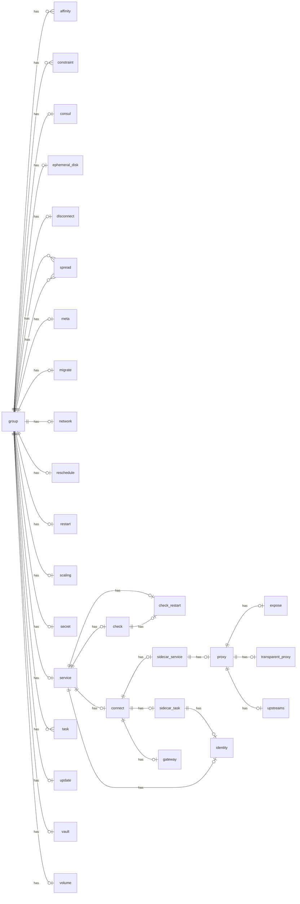

# Nomad job spec entities

```mermaid
erDiagram
    direction LR
    
    group ||--o{ affinity : has
    group ||--o{ constraint : has
    group ||--o| consul : has
    group ||--o| ephemeral_disk : has
    group ||--o| disconnect : has
    group ||--o{ spread : has
    group ||--o| meta : has
    group ||--o| migrate : has
    group ||--o| network : has
    group ||--o| reschedule : has
    group ||--o| restart : has
    group ||--o| scaling : has
    group ||--o| secret : has
    group ||--o| service : has
    group ||--o{ spread : has
    group ||--o{ task : has
    group ||--o| update : has
    group ||--o| vault : has
    group ||--o| volume : has
    

    check ||--o| check_restart : has

    connect ||--o| sidecar_service : has
    connect ||--o| sidecar_task : has
    connect ||--o| gateway : has

    proxy ||--o| expose : has
    proxy ||--o| transparent_proxy : has
    proxy ||--o| upstreams : has

    service ||--o| check : has
    service ||--o| check_restart : has
    service ||--o| connect : has
    service ||--o| identity : has

    sidecar_service ||--o| proxy : has

    sidecar_task ||--o| identity : has
     

    affinity {}
    check {}
    check_restart {}
    constraint {}
    consul {}
    disconnect {}
    ephemeral_disk {}
    group {}
    meta {}
    migrate {}
    network {}
    proxy {}
    reschedule {}
    restart {}
    scaling {}
    secret {}
    service {}
    sidecar_service {}
    sidecar_task {}
    spread {}
    task {}
    transparent_proxy {}
    update {}
    upstreams {}
    volume {}

```