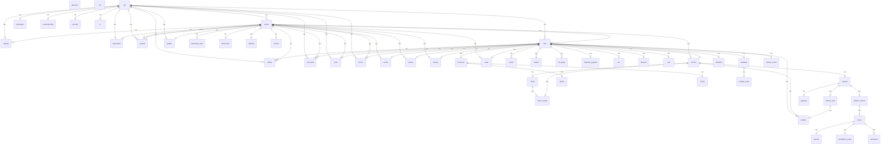

# Nomad job spec entities

```mermaid
erDiagram
    direction TD
    
    job ||--o{ affinity : has
    job ||--o{ constraint : has
    job ||--o{ group : has
    job ||--o| meta : has
    job ||--o| migrate : has
    job ||--o| multiregion : has
    job ||--o| parameterized : has
    job ||--o| periodic : has
    job ||--o| reschedule : has
    job ||--o| secret : has
    job ||--o{ spread : has
    job ||--o{ task : has
    job ||--o| ui : has
    job ||--o| update : has

    group ||--o{ affinity : has
    group ||--o{ constraint : has
    group ||--o| consul : has
    group ||--o| ephemeral_disk : has
    group ||--o| disconnect : has
    group ||--o{ spread : has
    group ||--o| meta : has
    group ||--o| migrate : has
    group ||--o| network : has
    group ||--o| reschedule : has
    group ||--o| restart : has
    group ||--o| scaling : has
    group ||--o| secret : has
    group ||--o| service : has
    group ||--o{ spread : has
    group ||--o{ task : has
    group ||--o| update : has
    group ||--o| vault : has
    group ||--o| volume : has

    task ||--o{ action : has
    task ||--o{ affinity : has
    task ||--o{ artifact : has    
    task ||--o{ constraint : has
    task ||--o| consul : has
    task ||--o{ csi_plugin : has
    task ||--o| dispatch_payload : has
    task ||--o| env : has
    task ||--o| identity : has
    task ||--o| lifecycle : has
    task ||--o| logs : has
    task ||--o| meta : has
    task ||--o| resources : has
    task ||--o| restart : has
    task ||--o| secret : has
    task ||--o| service : has
    task ||--o| schedule : has
    task ||--o| scaling : has
    task ||--o| template : has
    task ||--o| vault : has
    task ||--o| volume_mount : has

    check ||--o| check_restart : has

    connect ||--o| sidecar_service : has
    connect ||--o| sidecar_task : has
    connect ||--o| gateway : has

    proxy ||--o| expose : has
    proxy ||--o| transparent_proxy : has
    proxy ||--o| upstreams : has

    resources ||--o| device : has
    resources ||--o| numa : has

    service ||--o| check : has
    service ||--o| check_restart : has
    service ||--o| connect : has
    service ||--o| identity : has

    sidecar_service ||--o| proxy : has

    sidecar_task ||--o| identity : has

    template ||--o| change_script : has

    job {}
    group {}
    task {}
    action {}
    affinity {}
    artifact {}
    change_script {}
    check {}
    check_restart {}
    connect {}
    constraint {}
    consul {}
    csi_plugin {}
    device {}
    disconnect {}
    dispatch_payload {}
    env {}
    ephemeral_disk {}
    expose {}
    gateway {}
    group {}
    identity {}
    job {}
    lifecycle {}
    logs {}
    meta {}
    migrate {}
    multiregion {}
    network {}
    numa {}
    parameterized {}
    periodic {}
    proxy {}
    reschedule {}
    resources {}
    restart {}
    scaling {}
    schedule {}
    secret {}
    service {}
    sidecar_service {}
    sidecar_task {}
    spread {}
    template {}
    transparent_proxy {}
    ui {}
    update {}
    upstreams {}
    volume {}
    volume_mount {}
```