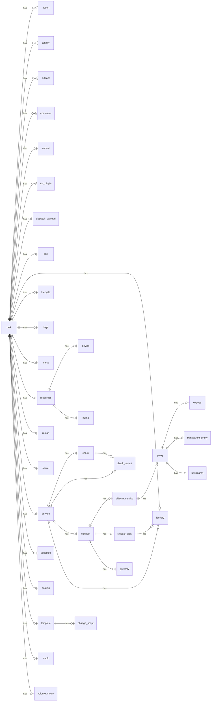

# Nomad job spec entities

```mermaid
erDiagram
    direction LR
    
    task ||--o{ action : has
    task ||--o{ affinity : has
    task ||--o{ artifact : has    
    task ||--o{ constraint : has
    task ||--o| consul : has
    task ||--o{ csi_plugin : has
    task ||--o| dispatch_payload : has
    task ||--o| env : has
    task ||--o| identity : has
    task ||--o| lifecycle : has
    task ||--o| logs : has
    task ||--o| meta : has
    task ||--o| resources : has
    task ||--o| restart : has
    task ||--o| secret : has
    task ||--o| service : has
    task ||--o| schedule : has
    task ||--o| scaling : has
    task ||--o| template : has
    task ||--o| vault : has
    task ||--o| volume_mount : has

    check ||--o| check_restart : has

    connect ||--o| sidecar_service : has
    connect ||--o| sidecar_task : has
    connect ||--o| gateway : has

    proxy ||--o| expose : has
    proxy ||--o| transparent_proxy : has
    proxy ||--o| upstreams : has

    resources ||--o| device : has
    resources ||--o| numa : has

    service ||--o| check : has
    service ||--o| check_restart : has
    service ||--o| connect : has
    service ||--o| identity : has

    sidecar_service ||--o| proxy : has

    sidecar_task ||--o| identity : has

    template ||--o| change_script : has

    
    task {}
    action {}
    affinity {}
    artifact {}
    change_script {}
    check {}
    check_restart {}
    connect {}
    constraint {}
    consul {}
    csi_plugin {}
    device {}
    
    dispatch_payload {}
    env {}
    
    expose {}
    gateway {}
    
    identity {}
   
    lifecycle {}
    logs {}
    meta {}
    
    
    
    numa {}
    proxy {}
    
    resources {}
    restart {}
    scaling {}
    schedule {}
    secret {}
    service {}
    sidecar_service {}
    sidecar_task {}
    
    template {}
    transparent_proxy {}
    
    
    upstreams {}
    
    volume_mount {}
```